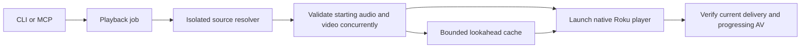

# Architecture and latency

Roomcast has three boundaries: source discovery, bounded media delivery, and
verified device control. Python coordinates asynchronous I/O. Chromium discovers
current URLs; FFmpeg probes, decodes for validation, and remuxes when necessary;
Roku's native Video node renders the stream. No video is encoded in Python.

## Work on the critical path

1. Verify the paired TV and replacement intent. Accept one playback job.
2. Discover the current provider menu and fresh playlists in an isolated browser.
   Text-only resolution skips images/fonts; an HLS response wakes the resolver
   immediately. Interactive browsing keeps its normal page resources.
3. Select a compatible presentation. Reject known incompatible dimensions/codecs
   from fMP4 initialization data before fetching a large video fragment. Unknown
   init metadata is left for full segment inspection. Validate only the complete segment needed
   at the requested timestamp in each track. Retain the full VOD timeline.
   The preferred provider subtitle file loads alongside media preparation.
4. Publish the session and launch the TV while preparing the following segments.
5. Confirm the intended app/player, both formats, current-session delivery and
   two advancing samples. Continue monitoring after returning success.

The default CLI/MCP call waits for step 5. The HTTP API preserves asynchronous
`POST /play`; `POST /play?wait=true` waits for the same job without holding the
control lock. Stop can cancel either form. A client disconnect leaves an accepted
job running. The service startup deadline is 110 seconds; clients allow 120.

## Media ownership

Each session owns its URLs, opaque token, pinned playlists/init data, cache and
tasks. Stop closes all of them. A shared download is shielded from an individual
waiter's cancellation; session close cancels the actual work and subprocesses.

Lookahead is driven by delivered segments and requested seek positions. Two
workers may speculate on at most four queued objects; two of the four work slots
remain available to demand. Audio/video timelines remain separate, and init data
is coalesced across readers. Speculation never triggers further speculation.
Failed speculative reads do not poison unrelated playback; demanded failure is
reported and ends that session. Every served media segment still passes full
decode validation. Cache eviction causes refetch and revalidation.

## TV player

Roomcast Player 1.4.0 owns one SceneGraph Video node and one `roInput` message
loop. It supports launch, replacement after the previous stream stops, exact
seeking, native captions and the native remote UI. The old upstream audio UI,
settings, queue and duplicated deep-link parsers are removed. Only the existing
branding assets are retained from Media Assistant, with its license.

Caption confirmation waits for the new content's first playing state. A reused
Video node may retain the previous title's tracks while stopping or buffering;
those fields must not acknowledge a new subtitle request or consume its retry window.

The manifest has no artificial splash minimum and enables input launches.
The native decoder and buffering remain Roku OS components. We have not changed
firmware or established a universal minimum startup time. Roku documents
[input launches and splash timing](https://developer.roku.com/dev/docs/channel-manifest)
and the [Video node's startup measurements](https://developer.roku.com/dev/docs/video).
Live-HLS latency controls are not a substitute for optimizing this VOD pipeline.

## Measurements

`job.timings` reports cumulative elapsed seconds in each startup stage.
`job.first_av_seconds` measures from job start to the first observed healthy
playback with this session's delivery. `job.startup_seconds` extends through
confirmation. Neither includes the agent's own reasoning or tool transport.

`player` contains native `startup_seconds`, `manifest_seconds` and
`buffer_seconds` from Player 1.4.0. Reports are accepted only from the paired TV
with the active session token. Missing reports remain null; they are not invented
from server timing. These durations can overlap and should not be added to the
server's stage durations.

Relay `fetch_seconds`, `validation_seconds` and `remux_seconds` sum individual
jobs and can overlap. They are work totals, not elapsed startup time. Compare
the same title, timestamp, quality and device with fresh source resolution;
record cold versus already-running player launches separately. Device telemetry
cannot measure photons on the panel or audible output. Live evidence belongs in
[acceptance.md](acceptance.md).

Python remains appropriate while browser/CDN/decoder waits dominate. A language
rewrite would need profiling evidence of interpreter CPU or scheduling delay.
